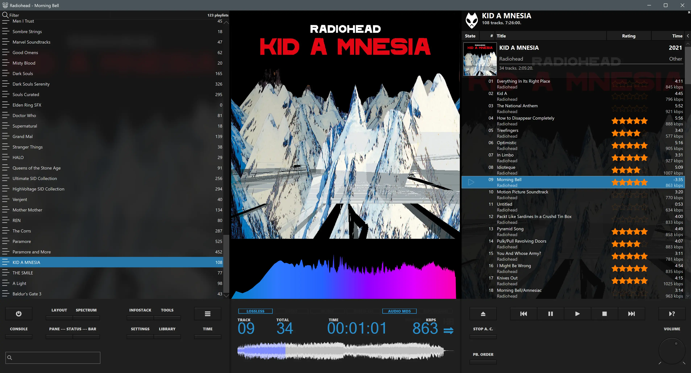
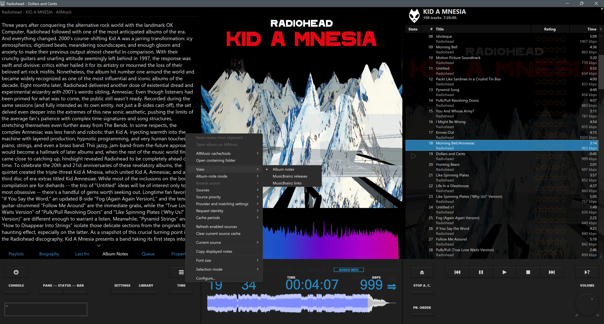

<h1 align="center">DarkOneJSP3</h1>

<p align="center">
  A modern x64 continuation of the DarkOne foobar2000 theme, rebuilt for
  Columns UI, JSplitter 4.x and JScript Panel 3.
</p>

<p align="center">
  <strong>Current stable release:</strong> v1.0.9
</p>

> [!IMPORTANT]
> DarkOneJSP3 is an unofficial community continuation. It is not an official
> release by tedGo, marc2003, Br3tt/Falstaff, dima-lur, Peter Pawlowski or the
> authors of the third-party components it uses.

## 📚 Table of Contents

- [✨ Overview](#overview)
- [📸 Screenshots](#screenshots)
- [🧩 Enhanced Sample Library](#enhanced-sample-library)
- [🛠️ Requirements and Installation](#requirements)
- [📖 Documentation](#documentation)
- [⚖️ Credits and attribution](#credits-and-attribution)

## Overview

DarkOneJSP3 brings the visual identity and workflow of the classic DarkOne
family to current 64-bit foobar2000 installations. It replaces the legacy
Panel Stack Splitter architecture with a modern scripted layout built around
Columns UI, JSplitter 4.x and JScript Panel 3.

The project expands DarkOne with deeper configuration, improved metadata and
playlist handling, optional startup effects, consolidated album information
and release-maintenance tooling, while retaining the character and familiar
workflow of the original theme.

### Highlights

* Modern six-controller JSplitter layout with persistent panel settings.
* JScript Panel 3 control, display, queue and information panels.
* Direct2D-accelerated rendering for a smoother, more responsive interface.
* Configurable InfoStack tabs, titles, dimensions, backgrounds and tab colours.
* Default or custom display accent colour.
* Consolidated Album Notes panel with configurable providers, source priority,
  caching, diagnostics and dedicated MusicBrainz Releases and Links views.
* Improved JS Playlist, Playlist Manager filtering and queue handling.
* Smooth scrolling for JS Playlist and Playlist Manager,
  with custom refresh interval overrides.
* Scripted Queue Viewer with direct JSplitter queue enumeration, multi-selection,
  keyboard navigation, source-item commands and writable queue controls.
* Scripted Quick Search with library/playlist scopes, persistent result modes,
  history/favourites, responsive sizing and protected Standard results playlists.
* Optional startup transitions with native-window reveal hardening.
* Demand-driven playlist rendering with cached selection/playback state, reused
  visible rows, cached column geometry and Direct2D bitmap reuse.
* Standalone enhanced JScript Panel samples with component-local dependencies
  and compatibility for older theme entry scripts.
* Synchronised, configurable bottom-area colours across JSP3 and JSplitter.

## Current release

**DarkOneJSP3 v1.0.9** is the current stable release.

The documented panel map is the recommended setup method. A maintainer-exported
FCL is included as an optional convenience for users who prefer to import a
starting layout.

## Screenshots





## Enhanced Sample Library

DarkOneJSP3 includes a standalone, upgraded library of JScript Panel 3 samples
inside `user-components-x64\foo_jscript_panel3`. These are the same enhanced
samples used by the theme, but they no longer require the separate
`DarkOneJSP3` project directory and can also be installed for other foobar2000
themes.

The library preserves the established sample filenames, module paths,
constructors and saved property keys, allowing existing themes and older saved
panel entries to continue using the upgraded implementations. Component-local
shared helpers provide the enhanced performance scheduling, UI cadence, colour
handling and reset support without coupling the samples to the DarkOneJSP3
layout.

Benefits for other themes include:

* Drop-in access to the enhanced Album Notes, MusicBrainz, playlist, playlist
  manager, queue, properties and Last.fm sample improvements.
* Backwards compatibility for older entry scripts through guarded helper and
  reset adapters.
* Neutral standalone reset and page-background integration, while retaining
  the established DarkOneJSP3 aliases and saved settings.
* A single maintained sample library shared by DarkOneJSP3 and other themes,
  avoiding divergent or theme-specific forks.

Back up an existing `foo_jscript_panel3\samples` directory and `helpers.txt`
before replacing them, particularly when another theme includes its own local
modifications. Individual top-level sample files can then be loaded normally
inside JScript Panel 3.

See the [Enhanced Sample Library Guide](DarkOneJSP3/docs/ENHANCED_SAMPLES.txt)
for standalone installation, compatibility guarantees and integration details.

## Requirements

* [foobar2000 v2 x64](https://www.foobar2000.org/windows)
* [Columns UI](https://www.foobar2000.org/components/view/foo_ui_columns)
* [JScript Panel 3.8.5](https://hydrogenaudio.org/index.php/topic,110516.msg1067716.html#msg1067716)
* [JSplitter 4.x, tested with 4.1.12](https://github.com/dima-lur/jsplitter/releases)
* [Queue Viewer](https://marc2k3.github.io/component/queue-viewer/)
* [Quick Search Toolbar](https://www.foobar2000.org/components/view/foo_quicksearch)
* [Enhanced Spectrum Analyser](https://hydrogenaudio.org/index.php/topic,116014.msg1026710.html#msg1026710)
* [Waveform Minibar (mod)](https://www.foobar2000.org/components/view/foo_wave_minibar_mod)

Third-party component binaries are not included. Install compatible versions
from their official project pages or trusted foobar2000 component sources
before configuring the theme.

## Installation

> [!TIP]
> **New to DarkOneJSP3?** Visit the [DarkOneJSP3 Wiki](https://github.com/Pav-Osmolski/DarkOneJSP3/wiki) for detailed installation guidance, configuration help, panel setup instructions, troubleshooting and additional project documentation.

Back up your active foobar2000 profile before installing or upgrading.

The package contains two top-level directories: `DarkOneJSP3` and
`user-components-x64`. Merge both into the directory used by your active
foobar2000 profile.

The supplied JScript Panel sample tree can also be installed independently for
other themes; see the [Enhanced Sample Library Guide](DarkOneJSP3/docs/ENHANCED_SAMPLES.txt).
DarkOneJSP3 itself still requires both top-level directories.

### Standard installation (non-portable)

A standard foobar2000 v2 installation normally stores its active profile at:

```text
%APPDATA%\foobar2000-v2\profile\
```

`%APPDATA%` usually expands to:

```text
C:\Users\<username>\AppData\Roaming
```

Merge the package directories into the `profile` directory so the resulting
paths are:

```text
%APPDATA%\foobar2000-v2\profile\DarkOneJSP3\
%APPDATA%\foobar2000-v2\profile\user-components-x64\foo_jscript_panel3\samples\
```

You can paste `%APPDATA%\foobar2000-v2\profile` into the File Explorer address
bar to open the correct location directly. Do not copy these files into the
foobar2000 program directory for a normal non-portable installation.

### Portable installation

A portable installation commonly uses either the installation root itself:

```text
<foobar2000>\DarkOneJSP3\
<foobar2000>\user-components-x64\foo_jscript_panel3\samples\
```

or its `profile` subfolder:

```text
<foobar2000>\profile\DarkOneJSP3\
<foobar2000>\profile\user-components-x64\foo_jscript_panel3\samples\
```

Use only the structure already used by your active foobar2000 profile. Do not
install the files into more than one location.

### Quick setup (FCL import)

The included
[`DarkOneJSP3/fcl/DarkOneJSP3.fcl`](DarkOneJSP3/fcl/DarkOneJSP3.fcl) is a
maintainer-exported convenience snapshot.

The FCL contains two saved layouts: `DarkOneJSP3` uses the scripted Queue
Viewer and scripted JScript Panel 3 Quick Search, while `DarkOneJSP3 Native`
uses the native Queue Viewer and Quick Search Toolbar components.

After importing it, compare the resulting layout with the documented panel
titles and script assignments. The panel map remains the reference for the
supported layout.

### Manual setup

Construct the Columns UI hierarchy using the supplied panel map, then assign
the documented panel titles and scripts.

See:

* [Installation Guide](DarkOneJSP3/docs/INSTALLATION.txt)
* [Layout and Panel Map](DarkOneJSP3/docs/LAYOUT_AND_PANEL_MAP.txt)

## Documentation

* [DarkOneJSP3 Wiki](https://github.com/Pav-Osmolski/DarkOneJSP3/wiki)
* [Installation Guide](DarkOneJSP3/docs/INSTALLATION.txt)
* [Layout and Panel Map](DarkOneJSP3/docs/LAYOUT_AND_PANEL_MAP.txt)
* [Configuration Guide](DarkOneJSP3/docs/CONFIGURATION_GUIDE.txt)
* [Enhanced Sample Library Guide](DarkOneJSP3/docs/ENHANCED_SAMPLES.txt)
* [Troubleshooting](DarkOneJSP3/docs/TROUBLESHOOTING.txt)
* [Migration Reference](DarkOneJSP3/docs/MIGRATION_REFERENCE.txt)
* [Changelog](DarkOneJSP3/docs/CHANGELOG.txt)
* [Credits](DarkOneJSP3/docs/CREDITS.txt)
* [Validation Report](DarkOneJSP3/docs/VALIDATION_REPORT.txt)

## Repository layout

```text
assets/
├── darkonejsp3-logo.png                    Repository artwork used by this README
├── darkonejsp3-social.jpg                  Promotional artwork used by the Wiki
├── darkonejsp3-screenshot-albumnotes.webp  Album Notes and InfoStack screenshot
└── darkonejsp3-screenshot-main.webp        Main DarkOneJSP3 interface screenshot

DarkOneJSP3/
├── docs/                  Documentation, changelog, credits and user guides
├── fcl/                   Optional maintainer-exported Columns UI layout
├── images/                DarkOne artwork and display/icon sheets
├── jscript/               DarkOne JScript Panel 3 wrappers and modules
├── jsplitter/             JSplitter controllers, loaders and shared helpers
├── reference/             Original DarkOne2021 migration reference
├── shared/                Shared project scripts and reset support
├── tools/                 Modular release validator and mirror-sync utility
├── build-info.json        Release metadata
└── darkonejsp3-layout-manifest.json
                           Supported layout and package manifest

user-components-x64/
└── foo_jscript_panel3/
    ├── licenses/          Retained third-party licence notices
    └── samples/           Standalone enhanced sample library used by
                           DarkOneJSP3 and compatible foobar2000 themes
```

## Validation

Run the validator from the package or repository root containing both
`DarkOneJSP3` and `user-components-x64`:

```text
python DarkOneJSP3/tools/validate_release.py .
```

The validator checks package structure, namespaces, imports, reset coverage,
metadata, documentation consistency, JavaScript syntax, Python compilation and
intentional compatibility mirrors and generated adapters.

## Credits and attribution

DarkOneJSP3 exists because of the work of many people:

* **tedGo** — creator of the original DarkOne theme and DarkOne4Mod; original
  visual identity, layout concepts, artwork and foundational control/display
  scripts.
* **DeViLhoOD** — DarkOne2021 adaptation; DarkOneJSP3 project direction,
  migration, integration, design decisions, testing and maintenance.
* **Br3tt / Falstaff** — original JS Playlist, Smooth Playlist Manager and
  related playlist scripts used as foundations for adapted panels.
* **marc2003** — creator and maintainer of JScript Panel 3 and author of many
  sample scripts used or adapted by the project.
* **dima-lur** — creator and maintainer of JSplitter.
* **Case** and **T. P. Wang** — additional sample contributions retained in the
  JScript Panel sample tree.
* The authors and maintainers of foobar2000, Columns UI, Quick Search Toolbar,
  Enhanced Spectrum Analyser, Waveform Minibar (mod) and every other required
  component.

Preserve all existing author headers, credits and third-party licence notices.

No blanket licence is asserted over inherited DarkOne artwork or third-party
component or sample code. Do not redistribute foobar2000 binaries. See the
[Credits](DarkOneJSP3/docs/CREDITS.txt) for detailed attribution.

## Disclaimer

DarkOneJSP3 is supplied without warranty. Back up your foobar2000 profile before
installation or upgrade.

The project is independent of foobar2000 and all named third-party authors,
maintainers and projects.
