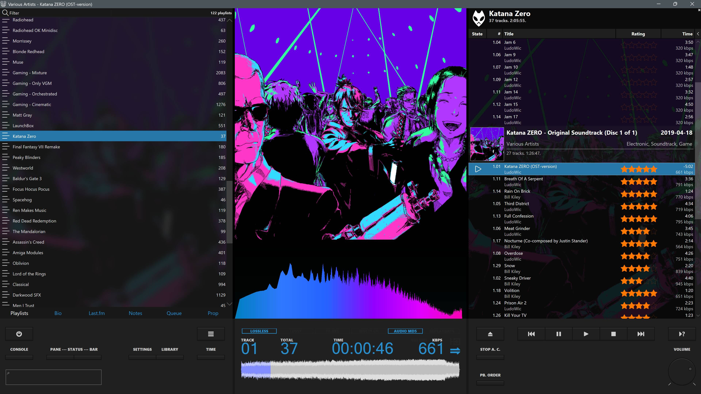
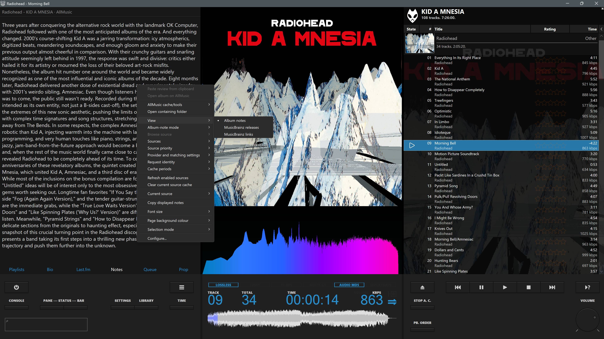

<p align="center">
  
</p>

<h1 align="center">DarkOneJSP3</h1>

<p align="center">
  A modern x64 continuation of the DarkOne foobar2000 theme, rebuilt for
  Columns UI, JSplitter 4.x and JScript Panel 3.
</p>

<p align="center">
  <strong>Current stable release:</strong> v0.9.7
</p>

> [!IMPORTANT]
> DarkOneJSP3 is an unofficial community continuation. It is not an official
> release by tedGo, marc2003, Br3tt/Falstaff, dima-lur, Peter Pawlowski or the
> authors of the third-party components it uses.

## 📚 Table of Contents

- [✨ Overview](#overview)
- [📸 Screenshots](#screenshots)
- [🛠️ Requirements and Installation](#requirements)
- [📖 Documentation](#documentation)
- [⚖️ Credits and attribution](#credits-and-attribution)

## Overview

DarkOneJSP3 brings the visual identity and workflow of the classic DarkOne
family to current 64-bit foobar2000 installations. It replaces the legacy
Panel Stack Splitter architecture with a modern scripted layout built around
Columns UI, JSplitter 4.x and JScript Panel 3.

The project expands DarkOne with deeper configuration, improved metadata and
playlist handling, optional startup effects, consolidated album information
and release-maintenance tooling, while retaining the character and familiar
workflow of the original theme.

### Highlights

* Modern six-controller JSplitter layout with persistent panel settings.
* JScript Panel 3 control, display, queue and information panels.
* Configurable InfoStack tabs, titles, dimensions, backgrounds and tab colours.
* Independent page backgrounds for Biography, Last.fm, Album Notes, Properties
  and the optional scripted Queue Viewer.
* Coordinated background palettes for the InfoStack backing, upper side
  dividers and waveform host.
* Default or custom display accent colour.
* Consolidated Album Notes panel with configurable providers, source priority,
  caching, diagnostics and dedicated MusicBrainz Releases and Links views.
* Improved playlist scrolling, playlist-manager filtering and queue handling.
* Enhanced optional scripted Queue Viewer with multi-selection, keyboard
  navigation and source-item commands.
* Optional startup transitions with native-window reveal hardening.
* Demand-driven playlist rendering with cached title formatting and Direct2D
  bitmap reuse.
* Release validation, compatibility-mirror checking and maintenance utilities.

## Current release

**DarkOneJSP3 v0.9.7** is the current stable release.

The documented panel map is the recommended setup method. A maintainer-exported
FCL is included as an optional convenience for users who prefer to import a
starting layout.

## Screenshots





## Requirements

* [foobar2000 v2 x64](https://www.foobar2000.org/windows)
* [Columns UI](https://www.foobar2000.org/components/view/foo_ui_columns)
* [JScript Panel 3.8.5](https://hydrogenaudio.org/index.php/topic,110516.msg1067716.html#msg1067716)
* [JSplitter 4.x, tested with 4.1.11](https://github.com/dima-lur/jsplitter/releases)
* [Queue Viewer](https://marc2k3.github.io/component/queue-viewer/)
* [Quick Search Toolbar](https://www.foobar2000.org/components/view/foo_quicksearch)
* [Enhanced Spectrum Analyser](https://hydrogenaudio.org/index.php/topic,116014.msg1026710.html#msg1026710)
* [Waveform Minibar (mod)](https://www.foobar2000.org/components/view/foo_wave_minibar_mod)

The native Queue Viewer component is recommended because it provides complete
playback-queue editing. A bundled JScript Panel Queue Viewer script is included
as an optional lightweight fallback with selection, keyboard navigation and
source-item commands. JScript Panel 3 no longer exposes the playback-queue
mutation functions required to add, remove, reorder or clear entries from a
scripted panel.

Third-party component binaries are not included. Install compatible versions
from their official project pages or trusted foobar2000 component sources
before configuring the theme.

## Installation

Back up your active foobar2000 profile before installing or upgrading.

Merge the supplied `DarkOneJSP3` and `user-components-x64` directories into
the location used by your active foobar2000 profile.

Depending on the installation, the resulting paths will normally use one of
the following structures.

### Installation-root profile

```text
<foobar2000>\DarkOneJSP3\
<foobar2000>\user-components-x64\foo_jscript_panel3\samples\
```

### `profile` subfolder

```text
<foobar2000>\profile\DarkOneJSP3\
<foobar2000>\profile\user-components-x64\foo_jscript_panel3\samples\
```

Use the structure already used by your foobar2000 installation. Do not install
the files into both locations.

### Recommended setup

Construct the Columns UI hierarchy using the supplied panel map, then assign
the documented panel titles and scripts.

See:

* [Installation Guide](DarkOneJSP3/docs/INSTALLATION.txt)
* [Layout and Panel Map](DarkOneJSP3/docs/LAYOUT_AND_PANEL_MAP.txt)

### Optional FCL import

The included
[`DarkOneJSP3/fcl/DarkOneJSP3.fcl`](DarkOneJSP3/fcl/DarkOneJSP3.fcl) is a
maintainer-exported convenience snapshot. It is not required.

After importing it, compare the resulting layout with the documented panel
titles and script assignments. The panel map remains the reference for the
supported layout.

Project tooling, release hardening and hotfixes intentionally never patch or
regenerate the FCL.

## Documentation

* [Installation Guide](DarkOneJSP3/docs/INSTALLATION.txt)
* [Layout and Panel Map](DarkOneJSP3/docs/LAYOUT_AND_PANEL_MAP.txt)
* [Configuration Guide](DarkOneJSP3/docs/CONFIGURATION_GUIDE.txt)
* [Troubleshooting](DarkOneJSP3/docs/TROUBLESHOOTING.txt)
* [Migration Reference](DarkOneJSP3/docs/MIGRATION_REFERENCE.txt)
* [Changelog](DarkOneJSP3/docs/CHANGELOG.txt)
* [Credits](DarkOneJSP3/docs/CREDITS.txt)
* [Validation Report](DarkOneJSP3/docs/VALIDATION_REPORT.txt)

## Repository layout

```text
assets/
└── darkonejsp3-logo.png   Repository artwork used by this README

DarkOneJSP3/
├── docs/                  Documentation, changelog and credits
├── fcl/                   Optional maintainer-exported Columns UI layout
├── images/                DarkOne artwork and display/icon sheets
├── jscript/               DarkOne JScript Panel 3 wrappers and modules
├── jsplitter/             JSplitter controllers, loaders and shared helpers
├── reference/             Original DarkOne2021 migration reference
├── shared/                Shared project scripts and reset support
├── tools/                 Modular release validator and mirror-sync utility
├── build-info.json        Release metadata
└── darkonejsp3-layout-manifest.json
                           Supported layout and package manifest

user-components-x64/
└── foo_jscript_panel3/
    ├── licenses/          Retained third-party licence notices
    └── samples/           DarkOneJSP3-enhanced sample scripts
```

## Validation

Run the validator from the package or repository root containing both
`DarkOneJSP3` and `user-components-x64`:

```text
python DarkOneJSP3/tools/validate_release.py .
```

The validator checks package structure, namespaces, imports, reset coverage,
metadata, documentation consistency, JavaScript syntax, Python compilation and
intentional compatibility mirrors.

## Credits and attribution

DarkOneJSP3 exists because of the work of many people:

* **tedGo** — creator of the original DarkOne theme and DarkOne4Mod; original
  visual identity, layout concepts, artwork and foundational control/display
  scripts.
* **DeViLhoOD** — DarkOne2021 adaptation; DarkOneJSP3 project direction,
  migration, integration, design decisions, testing and maintenance.
* **Br3tt / Falstaff** — original JS Playlist, Smooth Playlist Manager and
  related playlist scripts used as foundations for adapted panels.
* **marc2003** — creator and maintainer of JScript Panel 3 and author of many
  sample scripts used or adapted by the project.
* **dima-lur** — creator and maintainer of JSplitter.
* **Case** and **T. P. Wang** — additional sample contributions retained in the
  JScript Panel sample tree.
* The authors and maintainers of foobar2000, Columns UI, Quick Search Toolbar,
  Enhanced Spectrum Analyser, Waveform Minibar (mod) and every other required
  component.

Preserve all existing author headers, credits and third-party licence notices.

No blanket licence is asserted over inherited DarkOne artwork or third-party
component or sample code. Do not redistribute foobar2000 binaries. See the
[Credits](DarkOneJSP3/docs/CREDITS.txt) for detailed attribution.

## Contributing

Bug reports and focused pull requests are welcome once the repository is open
for public collaboration.

Please include:

* the foobar2000, Columns UI, JScript Panel and JSplitter versions;
* the exact panel or script involved;
* clear reproduction steps;
* relevant console output;
* screenshots where useful; and
* confirmation that the issue occurs on the current stable release.

Keep changes narrowly scoped, preserve existing author and licence notices, and
do not regenerate or modify `DarkOneJSP3/fcl/DarkOneJSP3.fcl` as part of
routine patches.

## Disclaimer

DarkOneJSP3 is supplied without warranty. Back up your foobar2000 profile before
installation or upgrade.

The project is independent of foobar2000 and all named third-party authors,
maintainers and projects.
